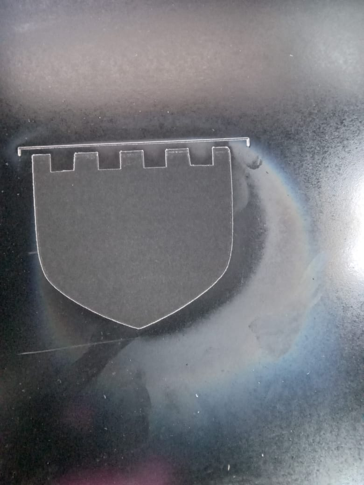

# 5. Activity of Day 5 
##                      Digital Fabrication I: CNC & Laser Cutting

### Objective
The objective of this session was to understand the main components of a laser cutter, learn safe operating procedures, and gain practical experience in controlling the machine, designing a cutting file, and performing both engraving and cutting operations.

### Laser Cutter Parts & Operation

Laser cutting employs a **high-powered, focused laser beam** to precisely cut, engrave, or mark a wide range of materials. From delicate wood and robust acrylic to plastics, leather, and thin metals, laser technology offers **broad material compatibility**.

**The Laser Source:** Heart of the Machine

The laser source (or laser tube) is the core component responsible for generating the laser beam used for cutting and engraving.

Understanding properties like wavelength, power rating(watts), and whether it's continuous or pulsed is crucial for optimal performance and material compatibility.

**Motion System:** 
The motion system enables the laser cutter to execute complex designs by precisely controlling the movement of the laser head on the workbed.

Motors: Stepper or servo motors provide accurate, controlled movement along the X and Y axes, allowing digital designs to be faithfully translated into physical cuts.

**Workbed**: Material Support
The workbed provides crucial support for materials during the laser cutting and engraving process, ensuring stability and optimal results.

**Exhaust & Cooling Systems**
These vital systems ensure both machine longevity and operator safety by managing byproducts and heat.

- Exhaust System : Removes hazardous smoke, toxic fumes, and particulate debris generated during cutting
maintaining air quality.

- Cooling System : Prevents the laser tube and other sensitive components from overheating, which can significantly shorten their lifespan.

- Water Cooling : commonly used used for CO₂ laser tubes, circulates cool water to dissipate heat effectively.

- Electronic Cooling : Fans cool power supplies and control electronics, preventing malfunction due to heat buildup.

**Control System & Software**

The control system translates your digital designs into precise physical actions for the laser cutter.
It converts vector and raster design files (e.g., DXF,SVG, AI) into machine-readable commands.

#### Operations & Safety practices
some of the safety include:

- do not look at the beam directly
- never leave an operating laser cutter unattended 
- do not wear reflective jewerly during alignment

A laser cutter is a sophisticated assembly of interconnected components working together to transform digital designs into physical creations.

### Activity -Laser Cutting

#### Implentation
=== "Step 1 - Machine setup"

The laser cutter was checked to ensure its running properly.

Acessed the laser cutter using its **IP address** through a desktop computer. This allowed remote connection to the machine control interface, where machine status and job control could be monitored.

=== "Step 2 - Design Preparation"

A sketch was created containing both **engraving** and **cutting** elements. The design was prepared in a suitable format for laser cutting and engraving.

The material was placed on the laser cutter  bed , and the laser focus was checked.

=== "Step 3 - Engraving"

Engraving was performed first using lower power and appropriate speed to mark the design without cutting through the material.

=== "Step 4-  Cutting Process"
After engraving, the laser parameters were adjusted to higher power  to **cut the final shape** from the material.

#### Challenges 
At first, the laser did not cut the material as expected, and sometimes it did not cut at all. Several adjustments to the settings and multiple attempts were needed before the cutting process worked properly.