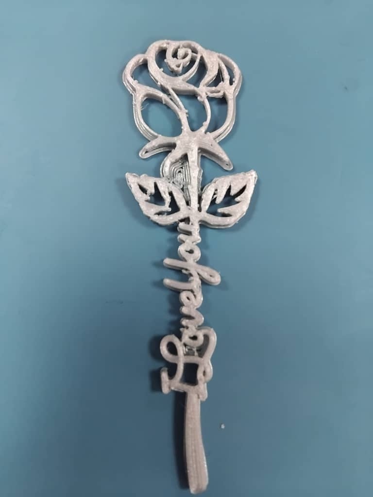

# 6. Activity of Day 6

            Digital Fabrication II: Additive Manufacturing

## 3D Printer Ultimaker

###  introduction 3D Printing

- Additive Manufacturing: 3D printing is an additive process that builds objects layer by layer according to a digital model.

- Fused Deposition Modeling (FDM): Ultimaker printers use FDM technology, melting and extruding thermoplastic filament to construct objects layer by 
layer.

- Digital to Physical: Tranforms virtual 3D models to tangible , 3-dimentional objects

### Main Components 
- **Print Head:** Houses the nozzle, feeder, and cooling fans responsible for material extrusion.
- **Filament System:** includes the spool holder and feeder gears that guide the filament to the print head.  
- **Build Plate:** The surface where your object is printed, often glass and heated for adhesion.
- **Motion System:** Controls the precise movement of the print head and build plate along the X, Y, and Z axes.  
- **Control & Electronics:** The screen and internal electronics manage all printer functions and user interaction.

## Implementation

### Tools used
- 3D printer Ultimaker 
- Ultimaker Cura software 

### Printer Setup & Calibration
- Load Filament: Feed filament properly into extruder  
- Level Build Plate: Ensure flatness for even first layers  
- Clean Build Surface: Remove oils/debris with isopropyl alcohol  
- Preheat Printer: Nozzle and bed reach target temperatures 
- Test Print

### Preparing the Digital Model

=== "Step 1 - Model Preparation"
 
- Create or download a 3D model (STL format) , in our case we downloaded it
- Import the model into **Ultimaker Cura**

=== "Step 2 - Key Slicing Settings"
- Adjust slicing settings, this can reduce the size, material usage, and printing time
- when desired setting is reached, save file in USB disk

=== "Step3  - Print"
- Initiate Print: Start from USB 
- Monitor First Layers: Ensure proper bed adhesion
- once it finishes, let cool down and safely remove it from plate

     
=== "Finishing "
- Remove object carefully  
- Detach support structures  

 

## Observation

- When printing a 3D object that is not flat, it often produces a complex mesh of printed lines.
- The printer takes its time in building the structure.

